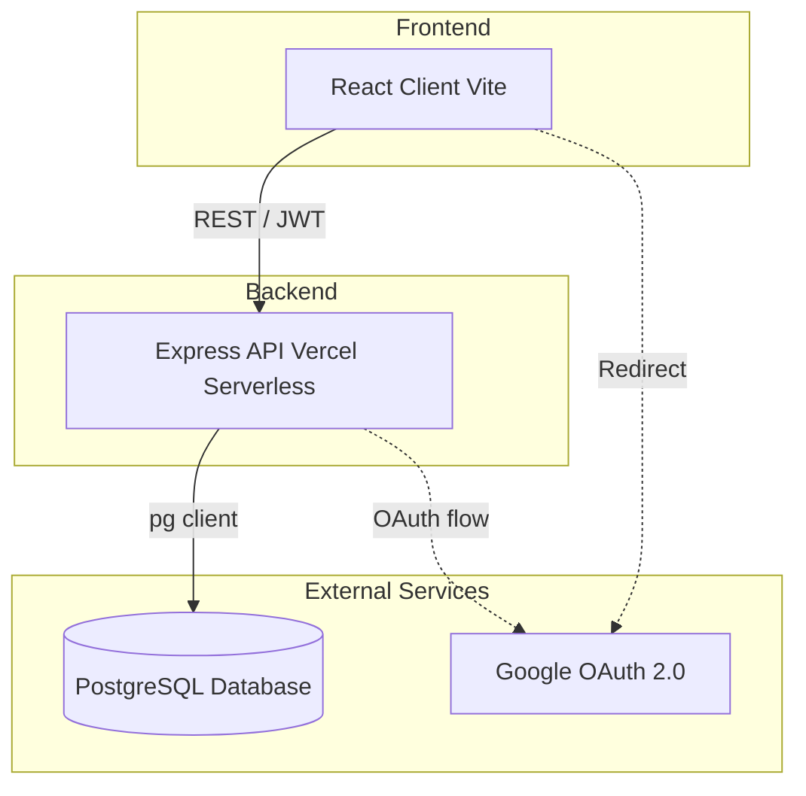

# HelpDesk Pro

An internal IT help desk for a medium-sized company. Employees register technology incidents and service requests, while the platform routes each request to the best available support team.

## Screenshots

> **Note:** Add your actual app screenshots to a `docs/` folder and update these paths!


## Architecture



## Demo Credentials

If you have run the database seed scripts during setup, you can log in with any seeded user's email (e.g., `aisha.sharma@company.com` for an employee, or `meera.pillai@helpdesk.internal` for an engineer). 

- **Employee Password:** `Employee@123`
- **Engineer Password:** `Engineer@123`

To promote a specific account to admin, you can run the promotion SQL script:
```bash
psql $env:DATABASE_URL -v admin_email="admin@company.com" -f database/promote-admin.sql
```

## Local Setup & Development

### 1. Environment Variables
Copy the server example `.env` file and fill in your details (Database connection string, Google OAuth credentials, etc.):
```bash
cp server/.env.example server/.env
```

### 2. Database Setup
Ensure you have a PostgreSQL database running (either locally or a cloud provider like Supabase/Neon). Run the setup scripts from the root directory to build the schema and seed demo data:
```bash
node server/setup-db.js
node server/seed-employees.js
node server/seed-engineers.js
```

### 3. Start the Application
Install all dependencies and start both the React frontend and Express backend concurrently:
```bash
npm install
npm run dev
```
Open `http://localhost:5173` in your browser!

## Vercel Deployment

This project is configured as a monorepo (client + server) and can be deployed directly to Vercel as a single project. The frontend will be served as a static site, and the backend Express API will be deployed as Serverless Functions.

1. Create a new project in your Vercel Dashboard and import this repository.
2. Ensure the **Framework Preset** is set to `Vite`.
3. Set the **Root Directory** to the root of the repository (do not change it to `client` or `server`).
4. In the **Build and Output Settings**:
   - Build Command: `npm run build`
   - Output Directory: `client/dist`
   - Install Command: `npm install`
5. Add all your database and auth environment variables from `server/.env` in the Vercel Environment Variables section. **Make sure your `CLIENT_URL` and `GOOGLE_CALLBACK_URL` point to your live Vercel domain!**
6. Click **Deploy**.

Vercel will build the React frontend and automatically route any requests starting with `/api/` to your Express backend (thanks to the `vercel.json` configuration).

## Features

- **Employee ticket registration:** Fast capture of category, priority, and descriptions.
- **Automatic routing:** Intelligent routing based on category and current team availability.
- **Support-team capacity:** Live indicators of how many engineers are available per team.
- **Lifecycle visibility:** Clear ticket status and assignment tracking for both employees and engineers.
- **Admin management:** Role-based access control and user management.
